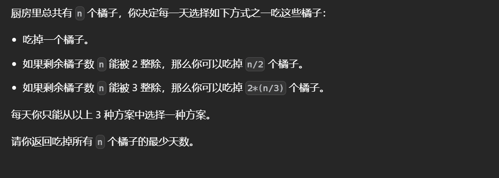
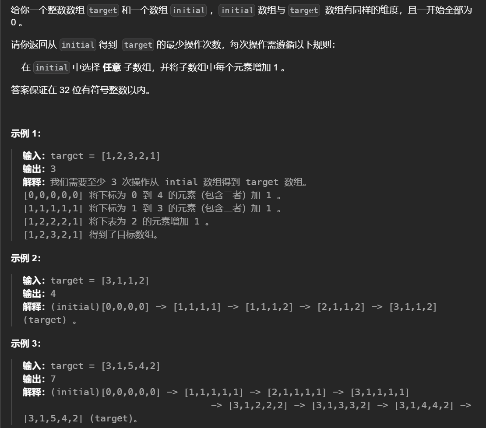
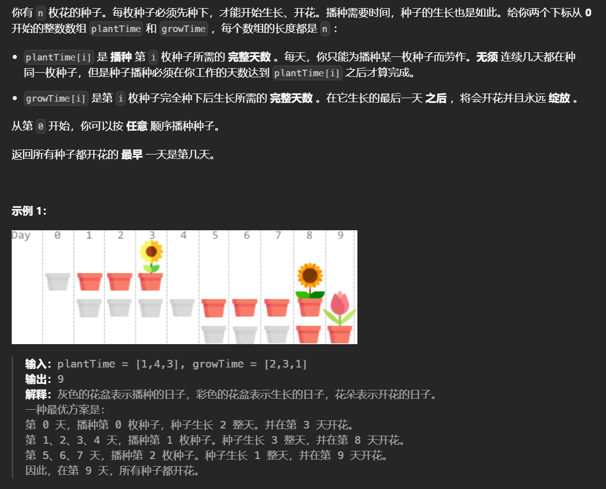
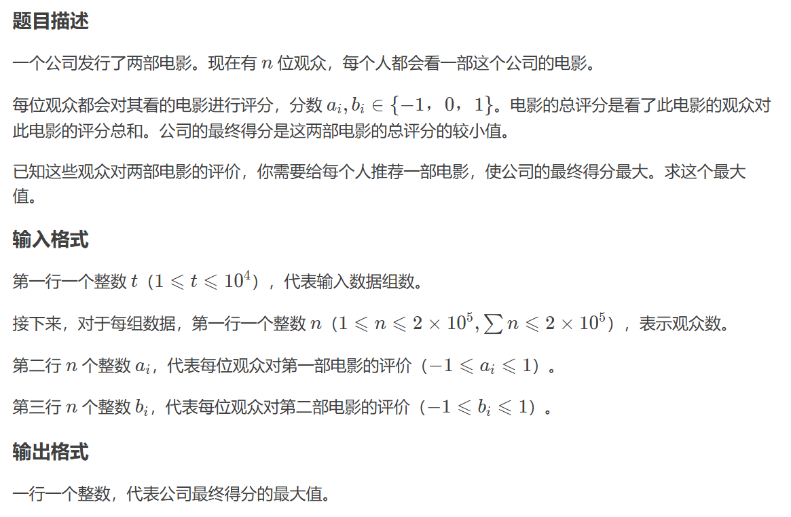

## 贪心

贪心算法指的是在对问题求解的时候选择从当前看来做好的选择，不从整体上考虑而是局部上，贪心算法不保证得到最优解，但某些问题的最优解就是贪心算法，需要判断一个问题是否适合用贪心求解。贪心是动态规划的一个特例。

比如在背包问题中，用承载能力有限的背包中带走最大价值的商品：
优先选择最有价值的商品装入背包

```python
goods=[(50,10),(120,30),(100,20)]
goods.sort(key=lambda x:x[0]/x[1],reverse=True)# 按照价值排序
def backpack(goods,w):
    m=[0 for _ in range(len(goods))]# 每种货物拿取的百分比
    for i ,(_,weight) in enumerate(goods):
        if w>=weight:
            m[i]=1
            w-=weight
        else:# 空间不够
            m[i]=w/weight
            w=0
            break
    return m
print(backpack(goods,50))
```

将一群非负整数组合出最大的值，同样是贪心的思想，将首位最大的放到前面

```python
li=[32,94,128,1286,6,71]

def number_join(li):
    li=list(map(str,li))
    li=sorted(li)
    li.reverse()
    return "".join(li)
print(number_join(li))
```

贪心算法重要的是选择最优的条件，在我呢提活动场地中（一个场地依次只能进行一个活动，每个活动有固定的开始时间和结束时间，问如何安排才能进行最多的活动）认为活动结束时间最早的为最优条件。

```python
a=[(1,4),(3,5),(0,6),(5,7),(3,9),(5,9),(6,10),(8,11),(8,12),(2,14),(12,16)]
a.sort(key=lambda x : x[1])
def activity(a):
    res=[a[0]]
    for i in range(1,len(a)):
        if a[i][0]>=res[-1][1]:# 当前活动的开始时间小于上一结束时间
            res.append(a[i])
    return res
print(activity(a))
```

### 执行子串操作后的字典序最小字符串


注意a前面是z而不是不存在，对每个字符进行替换，如果是a会变成z导致字典序变大，因此不能操作a字符，而其他的所有字符都可以前进一位。

贪心的思想，尽可能地将前面的值换掉，除非不能换。

```python
class Solution:0
    def smallestString(self, s: str) -> str:
        t=list(s)
        for i in range(len(s)):
            # 如果不是a的话，对他后面的元素操作，直到又遇到了a或者是到了末尾
            if t[i]!='a':
                for j in range(i,len(s)):
                    if t[j]=='a':
                        break
                    else:
                        t[j]=chr(ord(t[j])-1)
                return "".join(t)
        # 注意如果字符串全是a ，但又不能选择空的字符串，只能将字符串的最后一个元素换为z
        t[-1]='z'
        return "".join(t)
```


### Sakurako's Exam


1比较万能所以先让2相互抵消然后用1抵消剩下的2，最后让1相互抵消

```python
for _ in range(R()):
    l,r=RR()
    if l&1==0 and r&1==0:print('YES')
    elif l&1==0 and (r+(l>>1))&1==0:print('YES')
    else:print('NO')
```


### [使数组唯一的最小增量](https://leetcode.cn/problems/minimum-increment-to-make-array-unique/)


将数组排序后，保证其中的每个元素是唯一的即可

```python
class Solution:
    def minIncrementForUnique(self, nums: List[int]) -> int:
        nums.sort()
        ans=0
        for i in range(1,len(nums)):
            if  nums[i]<=nums[i-1]:
                ans+=nums[i-1]-nums[i]+1
                nums[i]=nums[i-1]+1
                
        return ans
```


### [减小和重新排列数组后的最大元素](https://leetcode.cn/problems/maximum-element-after-decreasing-and-rearranging/)	


排序加贪心

```python
class Solution(object):
    def maximumElementAfterDecrementingAndRearranging(self, arr):
        n=len(arr)
        arr.sort()
        arr[0]=1
        for i in range(1,n):
            # 元素值不能超过自身，因为操作里没有递增
            arr[i]=min(arr[i],arr[i-1]+1)
        return arr[-1]
```

### [具有给定数值的最小字符串](https://leetcode.cn/problems/smallest-string-with-a-given-numeric-value/)


贪心的思想，对于每个位置，为了保证字典序小，前面的位置应该尽可能小的选取值，而这个位置选取'a'的条件是后面的位置可以满足全取z而总和大于k-1,如果这个位置不能取a，那也应该尽可能地小，即取到k-26*n也就是后面的位置都取z，这个位置才能保证取到满足和为k的最小字符。

```python
class Solution:
    def getSmallestString(self, n: int, k: int) -> str:
        ans=[]
        def tran(n):
            return chr(n+ord('a')-1)
        for i in range(1,n+1):
            val =max(1,k-26*(n-i))
            k-=val
            ans.append(tran(val))
        return "".join(ans)
```

### [破坏回文串](https://leetcode.cn/problems/break-a-palindrome/)


回文串只需考虑前一半即可，对于中间的值不取，比如aba改中间的值没用。

按照贪心的思路，必然要把第一个不是a的改为a,一旦改变那么就不是回文串了可以直接返回，不然的话就说明字符串中全是a,将最后一个字符改为b即可

```python
class Solution:
    def breakPalindrome(self, p: str) -> str:
        if len(p)==1:
            return ""
        p=list(p)
        n=len(p)//2
        for i in range(n):
            c=p[i]
            if c!='a':
                p[i]='a'
                return "".join(p)
        p[-1]='b'
        return "".join(p)
```

### [连接棒材的最低费用](https://leetcode.cn/problems/minimum-cost-to-connect-sticks/)


为了保证成本最少，每次只连接最小的两个，使用优先级队列快速找出最小的两个


```python
import heapq
class Solution:
    def connectSticks(self, sticks: List[int]) -> int:
        heapq.heapify(sticks)
        ans=0
        while len(sticks)>1:
            a=heapq.heappop(sticks)
            b=heapq.heappop(sticks)
            val=a+b
            heapq.heappush(sticks,val)
            ans+=val
        return ans 
```

### [移除石子的最大得分](https://leetcode.cn/problems/maximum-score-from-removing-stones/)


数学的做法是:


贪心的做法是每次从最大的两个堆中取

```python
class Solution:
    def maximumScore(self, a: int, b: int, c: int) -> int:
        s=sorted([a,b,c])
        ans=0
        while s[1]:
            s[1]-=1
            s[2]-=1
            s.sort()
            ans+=1
        return ans
```

### [K 次增加后的最大乘积](https://leetcode.cn/problems/maximum-product-after-k-increments/)


为了让结果更大每次增加小的元素，使用根堆来找出数组中最小的元素


```python
class Solution:
    def maximumProduct(self, nums: List[int], k: int) -> int:
        m=10**9+7
        heapify(nums)
        index=0
        target=nums[-1]
        while k:
            val=heappop(nums)
            heappush(nums,val+1)
            k-=1
        val=1
        for i in nums:
            val*=i
            val%=m
        return val
```


### [ 吃掉 N 个橘子的最少天数](https://leetcode.cn/problems/minimum-number-of-days-to-eat-n-oranges/)




一定是做除法更好，在最优的操作下，如果能整除2则不存在-1-1再除2，因为大小上m-1-1/2=m/2-1，但是操作次数上后者会更少，同理如果能整除3则不会-1-1-1再除3。


```python
class Solution:
    def minDays(self, n: int) -> int:
        @cache
        def dp(i):
            if i<=1:return 1
        	# 一直做除法
            return min(dp(i//2)+i%2,dp(i//3)+i%3)+1
        return dp(n)
```


### [拆分成最多数目的正偶数之和](https://leetcode.cn/problems/maximum-split-of-positive-even-integers/)


贪心的思想，要尽可能多的数字又不能重复，因此从最小的2开始分，每次递增2，最后如果有余数加到数组的最后一个元素上。

```python
class Solution:
    def maximumEvenSplit(self, finalSum: int) -> List[int]:
        # 判断奇偶，偶数之和只能是偶数
        if finalSum&1:
            return []
        ans=[]
        index=2
        while index<=finalSum:
            ans.append(index)
            finalSum-=index
            index+=2
        ans[-1]+=finalSum
        return ans
```

### [使数组成为等数数组的最小代价](https://leetcode.cn/problems/minimum-cost-to-make-array-equalindromic/)


想要找到所有的数到一个数的代价最小，这个数不能是平均数而是`中位数`(技巧点)，想象一下，从1到n，`当选取得数在这个范围之间的时候，往右移动的过程中，距离左边的数越远距离（距离加上左边的数目乘上一），右边的数越近（距离减上右边的数目乘一），由此距离不断减小，当达到中间位置的时候距离最小`。

题目中要求找的数是回文数，数据范围在10^9之内，`打表计算(技巧点，构造回文表)`, 10^9这个范围的回文数可以通过递归左边的数求出，比如11奇数反转为111，偶数反转为1111， 枚举10^5-1,即99999反转，先奇数反转再偶数反转，保证数据的顺序性。

```python
from bisect import bisect_left as bf
# 打表，找出回文表
li=[]
base=1
while base<=10000:
    for i in range(base ,base*10):
        temp=i
        # 奇数反转先去掉最低位
        i//=10
        # 不断加个位
        while i:
            temp=temp*10+i%10
            i//=10
        li.append(temp)
    
    # 偶数反转不需要去掉最低位
    for i in range(base,base*10):
        temp=i
        while i:
            temp=temp*10+i%10
            i//=10
        li.append(temp)
    base*=10
    
class Solution:
    def minimumCost(self, nums: List[int]) -> int:
        n=len(nums)
        # 记得排序
        nums.sort()
        def f(x):
            return sum([abs(i-x) for i in nums])
        # 用二分法找距离中位数最近的回文数。偶数有两个中位数，这两个中位数之间（包括本身）到其他数的距离都属一样的，随意取
        i=bf(li,nums[(n-1)//2])
	# 如果中位数就是回文数，直接计算
        if li[i]==nums[n//2]:
            return f(li[i])
        # 如果不是的话，就找出li中位数附近的两个回文数，求出最小的
        return min(f(li[i-1]),f(li[i]))
```


### [使数组相等的最小开销](https://leetcode.cn/problems/minimum-cost-to-make-array-equal/)


运用中位数贪心的思想，把元素转换为他们的中位数可以得到最小的操作数，然而这道题目中，给定了每个元素转换的开销，原先的最小操作数认为开销为1，这里转换思路，`把cost[i]视为有cost[i]个nums[i]`，这样每次操作的开销满足条件同时也可以使用中位数贪心。

```python
class Solution:
    def minCost(self, nums: List[int], cost: List[int]) -> int:
        a=sorted(zip(nums,cost))
        mid=sum(cost)//2
        s=0
        for x,c in a:
            s+=c
            if s>mid:
                return sum([abs(v-x)*time for v,time in zip(nums,cost)])    
```


### 树上贪心


即在一棵树上找出不是直接根节点的两个节点。

如果一颗树的根节点的一个子树（节点数目最多）的节点数目没有超过这个根节点的一半，那么这个根节点的所有子节点都可以找到另一个满足条件的节点，满足的节点对是根节点数目的一半。

反之，可以找一个节点与这个这个子树的根节点配对，就这样一直递归下去。

```python
t=int(input())

def slove():
    n=int(input())
    li=list(map(int,input().split()))
    # 储存每个节点的节点数目（包括自己）
    v=[0]*n
    g=[[]for _ in range(n)]
    # 建图，做一位索引偏移
    for i,val in enumerate(li):
        g[val-1].append(i+1)
     # 找出所有结点的子树数目
    def init(x):
        # 自己算上
        v[x]=1
        # 找他的子树
        for j in g[x]:
            # 对他的子树操作
            init(j)
            # 该节点的节点数目一个加上子树的节点数目
            v[x]+=v[j]
            # 在这个过程中，把每个节点对应的最长的子树放到第一位，方便操作
            if v[j]>v[g[x][0]]:
                index=g[x].index(j)
                g[x][0],g[x][index]=g[x][index],g[x][0]
    init(0)
    # x是当前节点，other是迭代之前其他节点之和
    other=ans=x=0
    # 不断迭代
    while True:
        # 如果other有值代表情况二，在其他的节点中选一个出来与最长的子树的根节点匹配
        if other:
            ans+=1
            other-=1
            
        if not g[x]:
            break
        # 找到这个节点对应的最长的子树的根节点
        y=g[x][0]
        # 找到它的值
        val=v[y]
        # s是当前节点的总的节点数目（包括自己因此要减去，因为根节点在上一层迭代中进行过了），开始时当前节点是根节点
        s=v[x]-1
        # 如果小于等于一半，直接得出结果
        if 2*val<=s+other:
            ans+=(s+other)//2
            break
        # 反之，进行情况二，other记录除了最长的子树以外的节点
        other+=s-val
        # 下一轮从这个节点开始找，因为这个节点对应的值中最大的基本上是所有节点中最大的
        x=y
    print(ans)

while t:
    slove()
    t-=1

```

###  Memory for Arrays


问题可以抽象为背包问题，每次拿走一部分要求拿走最多的物品，按照贪心的思路每次拿最少的可以使一个背包空余的空间最多，因此把b数组排序求解问题。但是对于b中的1，如果用偶数解决它，偶数会变成奇数，那么可能会余下一个1（数组中除了1就是偶数），从而造成浪费，因此应该把1都给奇数解决。

```python
n,m=[int(x) for x in input().split()]
a=sorted([int(x) for x in input().split()])
b=sorted([int(x) for x in input().split()])
j=ans=0
for i in range(n):
    if j>=m or b[j]:
        break
    if a[i]&1:
        a[i]-=1
        j+=1
        ans+=1
i=0
while i<n and j<m:
    v=2**b[j]
    if v<=a[i]:
        a[i]-=v
        j+=1
        ans+=1
    else:
        i+=1
print(ans)
```

### [老鼠和奶酪](https://leetcode.cn/problems/mice-and-cheese/)	


两个变量的问题选择固定其中一个去找另一个，考虑如果k是1的情况，那么把所有的奶酪到给老鼠二，选择一个i给老鼠1最后的得分增加了r1[i]-r2[i]，为了使结果最大应该让这个值尽可能大。k>1的情况就是要给老鼠1k个r1[i]-r2[i]一个选出最大的这样的值，因此把两个数组的差值相减后排个序，从中选取k个。

```python
class Solution:
    def miceAndCheese(self, reward1: List[int], reward2: List[int], k: int) -> int:
        r=sorted([r1 -r2 for r1,r2 in zip(reward1,reward2)],reverse=True)
        return sum(reward2)+sum(r[:k])
```


```python
class Solution:
    def twoCitySchedCost(self, costs: List[List[int]]) -> int:
        n=len(costs)//2
        ans=sum([x[1] for x in costs])
        nums=sorted([x[0]-x[1] for x in costs])
        return ans+sum(nums[:n])
```


### [将数组分成几个递增序列](https://leetcode.cn/problems/divide-array-into-increasing-sequences/)


贪心的做法，由于要求序列不能出现相同的值，因此必须至少要分数组中出现频率最大的元素个序列，每个序列至少长k，则最终要求数组中至少有freq*k个元素。

```python
class Solution:
    def canDivideIntoSubsequences(self, nums: List[int], k: int) -> bool:
        memo=Counter(nums)
        val=max(memo.values())
        return len(nums)>=val*k
```

### [删除数对后的最小数组长度](https://leetcode.cn/problems/minimum-array-length-after-pair-removals/)


鸽巢原理

```python
class Solution:
    def minLengthAfterRemovals(self, nums: List[int]) -> int:
        memo=Counter(nums)
        cnt=max(memo.values())
        n=len(nums)
        if cnt*2>n:
            return 2*cnt-n
        else:
            l=n-cnt
            if (l-cnt)&1:
                return 1
            return 0
```


### [使所有字符相等的最小成本](https://leetcode.cn/problems/minimum-cost-to-make-all-characters-equal/)


对于一组串，其中不等的都是01组成的，而对于所有的01每次翻转左边或者右边都只能更改一对01串，并且不会影响已经相等的字符（不相等的还是不相等），因此一旦遇到不等的字符就会翻转

```python
class Solution:
    def minimumCost(self, s: str) -> int:
        n=len(s)
        ans=0
        for i in range(n-1):
            if s[i]!=s[i+1]:
                # 每次找翻转代价最小的
                ans+=min(i+1,n-i-1)
        return ans 
```


### [最长快乐字符串](https://leetcode.cn/problems/longest-happy-string/)


容易想到的是两个相同的一组中间用其他的字符隔开但是这样很难实现，贪心的思想每次取剩余的最多的字符，如果和前面两个一样就取次多的，如果次多的不存在就退出。

```python
class Solution:
    def longestDiverseString(self, a: int, b: int, c: int) -> str:
        nums=[]
        # 没有就不用加入
        if a:heappush(nums,(-a,'a'))
        if b:heappush(nums,(-b,'b'))
        if c:heappush(nums,(-c,'c'))
        s=''
        while nums:
            # 弹出剩余最多的
            cnt,c =heappop(nums)
            cnt=-cnt
            # 如果不满足条件就选择次多的
            if (len(s)>=2 and s[-2:]==2*c):
                if not nums:break
                cnt_,c_ =heappop(nums)
                cnt_=-cnt_
                s+=c_
                cnt_-=1
                # 如果没有值了就不要加入
                if cnt_:heappush(nums,(-cnt_,c_))
            else:
                s+=c
                cnt-=1
            if cnt:heappush(nums,(-cnt,c))
        return s
```

### [小于等于 K 的最长二进制子序列](https://leetcode.cn/problems/longest-binary-subsequence-less-than-or-equal-to-k/)


对于要找的子序列前面的前导0越多越好，应该在s靠后的位置找一个不大于k的子序列这样就可以加更多的0，找s中不超过K的最长后缀，如果不能往这个后缀中在添加1那么说明就只能添加0.

​	

```python
class Solution:
    def longestSubsequence(self, s: str, k: int) -> int:
        n,m=len(s),k.bit_length()
        if n<m:return n
        ans=m if int(s[-m:],2)<=k else m-1
        return ans+s[:-m].count('0')
        
```

### [通过最少操作次数使数组的和相等](https://leetcode.cn/problems/equal-sum-arrays-with-minimum-number-of-operations/)


考虑总和为了使得操作次数最少，应该每一次能使差值减少最大。对于总和较大的数组每个元素最小变为1，差值最多减小nums[i]-1。对于总和较小的数组每个元素最大变为6，差值最多减小6-nums[i]，统计这些变化量的个数。

```python
class Solution:
    def minOperations(self, nums1: List[int], nums2: List[int]) -> int:
        n1,n2=len(nums1),len(nums2)
        # 特判
        if max(n1,n2)>min(n1,n2)*6:return -1
        # 交换，方便操作
        t1,t2=sum(nums1),sum(nums2)
        if t1==t2:return 0
        if t1>t2:
            nums1,nums2=nums2,nums1
        # 差值
        d=abs(t1-t2)
        memo=[0]*6
        # 记录变化量
        for a in nums1:
            memo[6-a]+=1
        for b in nums2:
            memo[b-1]+=1
        
        ans=0
        # 从大到小枚举
        for i in range(5,0,-1):
            # 如果能直接消除差值，那么向上取整
            if i*memo[i]>=d:
                return ans+ceil(d/i)
            # 反之，累减
            d-=i*memo[i]
            ans+=memo[i]

        return ans 
```

### [无重叠区间](https://leetcode.cn/problems/non-overlapping-intervals/)


考虑问题：今天有好几个活动，每个活动有相应的开始和结束时间，同一时间段只能参加一个活动，问一天最多能参加多少个活动。贪心的思考就是要参加结束时间最早的活动使得有更多的空余时间去参加别的活动，同时对于结束时间相同的活动选择开始时间晚的留出更多的时间。将数组排序后依次遍历，对于不能满足的活动就排除。


```python
class Solution:
    def eraseOverlapIntervals(self, intervals: List[List[int]]) -> int:
        # 排序
        intervals.sort(key=lambda x:(x[1],x[0]))
        r=intervals[0][1]
        cnt=1
        for i in range(1,len(intervals)):
            # 可选
            if intervals[i][0]>=r:
                cnt+=1
                r=intervals[i][1]
        return len(intervals)-cnt
```


### [排布二进制网格的最少交换次数](https://leetcode.cn/problems/minimum-swaps-to-arrange-a-binary-grid/)


最少的交换次数按贪心的做法，一定是把在这个位置之下的第一个符合条件的放上来，对于给定的数据可以模拟暴力操作。

```python
class Solution:
    def minSwaps(self, grid: List[List[int]]) -> int:
        nums=[]
        vis=set()
        ans=i=temp=0
        n=len(grid)
        # 统计右边1的个数
        for g in grid:
            cnt=0
            for c in g[::-1]:
                if c==0:cnt+=1
                else:break
            nums.append(cnt)
        # 从上往下找
        while i<n:
            v=n-i-1
            j=i
            while j<n and nums[j]<v:j+=1
            if j==n:return -1
	
    	# 模拟交换顺便记录次数
            while j>i:
                nums[j],nums[j-1]=nums[j-1],nums[j]
                ans+=1
                j-=1
            i+=1

        return ans 
```


### Blue-Red Permutation


贪心的思想，把每个元素按照颜色分类，在找1到n的过程中如果蓝色有值就匹配蓝色中最小的，因为越小的蓝色和越大的红色表示的范围越小，把数尽可能的用蓝色去填充可以保证后面能匹配更多大的值，如果当前的蓝色小于当前值说明这个蓝色没有地方放无法满足，当蓝色用完了后去使用红色，如果红色大于当前值则这个位置无法填充不满足条件。


```python
import sys
input=sys.stdin.readline
from collections import deque
ans=[]
for _ in range(int(input())):
    n=int(input())
    nums=[int(x) for x in input().split()]
    color=input().rstrip()
    # 使用队列储存
    r=deque()
    b=deque()
    # 分类，注意要先排序
    for v,c in sorted([(a,b) for a,b in zip(nums,color)]):
        if c=='B':b.append(v)
        else:r.append(v)
    # 找1到n的数
    for i in range(1,n+1):
        v=i
        # 先弹出蓝色的
        if b:
            if b[0]>=v:
                b.popleft()
            else:
                # 队首的蓝色无处安放 
                ans.append('NO')
                break
        else:
            if r[0]<=v:
                r.popleft()
            else:
                ans.append('NO')
                break
    else:
        ans.append('YES')
for v in ans:
    print(v)
```

### [分割两个字符串得到回文串](https://leetcode.cn/problems/split-two-strings-to-make-palindrome/)


从同一个位置分开然后组合判断是否是回文串，如果前后缀相同就有可能是回文串，接着去判断中间的字符，前后缀能匹配的字母越多中间需要判断的字符就越少，因此找到最大的前后缀匹配字符然后去判断中间。

```python
class Solution:
    def checkPalindromeFormation(self, a: str, b: str) -> bool:
        n=len(a)
        def check(a,b):
            l,r=0,n-1
            while l<r and a[l]==b[r]:
                l+=1
                r-=1
            # 中间的那段
            s=a[l:r+1]
            t=b[l:r+1]
            return s==s[::-1] or t==t[::-1]
        # 两种情况
        return  check(a,b) or check(b,a)

```

### [形成目标数组的子数组最少增加次数](https://leetcode.cn/problems/minimum-number-of-increments-on-subarrays-to-form-a-target-array/)




贪心的做法：每个元素所需要的操作与它左边的相关，如果左边的数小于它，那么需要补一个差值，如果大于等于它那么就不要需要操作。	

```python
class Solution:
    def minNumberOperations(self, target: List[int]) -> int:
        n=len(target)
        # dp=[0]*n
        # dp[0]=target[0]
        # for i in range(1,n):
        #     if target[i]<=target[i-1]:
        #         dp[i]=dp[i-1]
        #     else:
        #         dp[i]=dp[i-1]+target[i]-target[i-1]
        # return dp[-1]
        ans=target[0]
        for i in range(1,n):
            if target[i]>target[i-1]:
                ans+=target[i]-target[i-1]
        return ans 
```


### [跳跃游戏 II](https://leetcode.cn/problems/jump-game-ii/)


贪心的做法，每次尽可能地走远，维护两个值一个标记终止位置一个表示当前可以走到的最远位置，一旦走到终止位置，那就需要跳一步，因为如果不跳跃的话就无法得到遍历后面的元素获得更远的位置。

```python
class Solution:
    def jump(self, nums: List[int]) -> int:
        n=len(nums)
        curr=mx=end=ans=0
        for i in range(n-1):
            mx=max(mx,i+nums[i])
            if i==end:
                ans+=1
                end=mx
        return ans 
```

### Rotation Matching


移动那个数组都一样，因此固定B去移动A，对于每个元素查看它在AB中的位置，如果在A中的位置靠左代表A数组需要向右移动r-l个单位才能保证这个元素满足要求，反之要移动l+n-r个单位才能相同，查询每个元素相等所需的A数组向右移动次数最多的那个就是最后能得到的最大的结果。

```python
from collections import Counter,defaultdict
n=int(input())
a=[int(x) for x in input().split()] 
b=[int(x) for x in input().split()]
l=Counter()
r=Counter()
for i in range(n):
    l[a[i]]=i
    r[b[i]]=i
cnt=Counter()
for i in range(1,n+1):
    l1,r1=l[i],r[i]
    if l1<=r1:
        cnt[r1-l1]+=1
    else:
        cnt[r1+n-l1]+=1
print(max(cnt.values()))

```


### [完成所有任务的最少初始能量](https://leetcode.cn/problems/minimum-initial-energy-to-finish-tasks/)


贪心的思想，对于每个任务min-actual是最少能剩余多少能量，倒序遍历保证剩余能量最多，从而可以遍历完所有的。

```python
class Solution:
    def minimumEffort(self, tasks: List[List[int]]) -> int:
        tasks.sort(key=lambda x:(x[1]-x[0]),reverse=True)
        # 一个表示当前能量一个表示初始能量
        t=ans=0
        for l,r in tasks:
            # 如果当前能量不满足只能增加
            if t<r:
                ans+=r-t
                t=r-l
            else:
                t-=l
        return ans
```

### [全部开花的最早一天](https://leetcode.cn/problems/earliest-possible-day-of-full-bloom/)




播种所需的时间是固定的，可以交替播种或者一个一个播种，两种方式所需的总播种时间是固定的，但是交替播种会使一个花的播种完成时间延后这一定是不好的，因此选择种完一个去种另一个。


```python
class Solution:
    def earliestFullBloom(self, plantTime: List[int], growTime: List[int]) -> int:
        d=ans=0
        for i,j in sorted(zip(plantTime,growTime),key=lambda x:-x[-1]):
            d+=i
            ans=max(ans,d+j)
        return ans 
```


### [ 移除后集合的最多元素数](https://leetcode.cn/problems/maximum-size-of-a-set-after-removals/)


逆向思维：从两个数组中取出一半的元素组合在一起

贪心的思想：每次取值要从两个数组中独有的取，且不能大于一半

```python
class Solution:
    def maximumSetSize(self, nums1: List[int], nums2: List[int]) -> int:
        n=len(nums1)
        nums1=set(nums1)
        nums2=set(nums2)
        common=len(nums1&nums2)
        # 独有的就是取出了重复值后再减去两个共有的
        a=min(len(nums1)-common,n//2)
        b=min(len(nums2)-common,n//2)
	# 如果没取满n，再从共有的里面取n-a-b个，如果不够就只能是common个
        return a+b+min(n-a-b,common)   
```


从正向看

```python
class Solution:
    def maximumSetSize(self, nums1: List[int], nums2: List[int]) -> int:
        n=len(nums1)
        m=n//2
        
        nums1=set(nums1)
        nums2=set(nums2)
        # 先假设不删除值设置初始的结果
        ans=len(nums1)+len(nums2)
        common=len(nums1&nums2)
        ans-=common
        
        # 如果删除的值不足一半
        if n-len(nums1)<m:
            temp=m-(n-len(nums1))
            # 先从重复的值中删除，这样可以保证最后结果最大
            if common>=temp:
                common-=temp
            else:
                # 如果重复的值不够，只能在删完重复的之后把出现一次的值删除
                temp-=common
                ans-=temp
                common=0
        # 对于另一个也是同样的操作
        if n-len(nums2)<m:
            temp=m-(n-len(nums2))
            if common>=temp:
                common-=temp
            else:
                temp-=common
                ans-=temp
                common=0
        
        return ans

```


### Cat, Fox and Double Maximum


题目大意是对于给定的排列找一个从1到n的排列使得对应位置相加后的新的排列得分最大，这个的得分最大指定的存在最多的峰(即一个数严格大于两边的数)

对于一个数组，最多可以构造n//2-1个这样的峰

对于该题认为一定可以构造出n//2-1个峰，观察样例发现，峰的位置要么是1 3 5...要么是2 4 6...，因此对该题直接构造，至于为什么，贪心有的时候是看感觉的。

```python
from collections import deque
import sys
input=sys.stdin.readline
for _ in range(int(input())):
    n=int(input())
    nums=[int(x) for x in input().split()]
    k=n//2-1
    ans=[0]*n
    # 提取出对应位置的值，把大的值赋给小的峰，把小的值赋给较大的谷底
    mx=[]
    mn=[]
    r=n
    l=1
    for i in range(n):
        if i&1 and i!=n-1:mx.append([nums[i],i])
        else:mn.append([nums[i],i])
    mx.sort(key=lambda x:x[0])
    mn.sort(key=lambda x:x[0])
    for i,j in mx:
        ans[j]=r
        r-=1
    for i,j in mn[::-1]:
        ans[j]=l
        l+=1
    temp=0
    # 如果 1 3 5等位置不可。那么就去找 2 4 6位置
    for i in range(1,n-1,2):
        if nums[i]+ans[i]>nums[i+1]+ans[i+1] and nums[i]+ans[i]>nums[i-1]+ans[i-1]:temp+=1
    if temp==k:print(*ans)
    else:
        mx=[]
        mn=[]
        ans=[0]*n
        r=n
        l=1
        for i in range(n):
            if i>=2 and i&1==0 and i!=n-1:mx.append([nums[i],i])
            else:mn.append([nums[i],i])
        mx.sort(key=lambda x:x[0])
        mn.sort(key=lambda x:x[0])
        for i,j in mx:
            ans[j]=r
            r-=1
        for i,j in mn[::-1]:
            ans[j]=l
            l+=1
        print(*ans)

```


### Alternating Subsequence


选取相邻异号的数字，要求最后的子序列和最大并且这个子序列的长度必须等于整个数组最长的相邻异号的长度。

为了取出相邻异号的数字，把数组中符号相同的分为一组，从每个组中取出一个数字这能做到取出最长的相邻异号的子序列，要求子数组和最大那么要在每个组中取出数是最大的。

```python
import sys
input=sys.stdin.readline

for _ in range(int(input())):
    n=int(input())
    nums=[int(x) for x in input().split()]
    i=0
    ans=0
    while i<n:
        start=i
        i+=1
        mx=nums[start]
        while i<n and nums[i]*nums[i-1]>0:
            mx=max(mx,nums[i])
            i+=1
        ans+=mx
    print(ans)
```

### [不可能得到的最短骰子序列](https://leetcode.cn/problems/shortest-impossible-sequence-of-rolls/)


题目大意是要找出一个最小的长度，对于这个长度在数组中无法找到所有元素的组合

贪心的思路：每次找出包含所有元素的最短前缀，找到了之后再继续往后找下一组。假设找到了m组那么一定能构造出长度为m的子序列，即从每一组中取出需要的，因此不能得到的最短子序列就是m+1

```python
class Solution:
    def shortestSequence(self, rolls: List[int], k: int) -> int:
        memo=Counter()
        m=0
        for r,x in enumerate(rolls):
            memo[x]+=1
            if len(memo)==k:
                m+=1
                memo=Counter()
        return m+1
```


### Alarm Clock 


把问题想象成是在一个数轴上有多个点

更具体一点就是：数轴上有 n 个点，要求任意长为 m-1 的闭区间不能包含 >= k 个点。问：至少要去掉多少个点？

维护窗口内的点的个数 cnt。枚举 $a_i$ 作为窗口右端点位置，如果窗口长度 ≥𝑚≥*m* 则移动窗口左端点 left*left*。如果发现 cnt=𝑘*cnt*=*k*，则优先删除窗口最右边的点，这样更右边的窗口可以包含的点更少，删除右边的点可以使一个区间能包含的点最少从而减少操作次数。

```python
from bisect import bisect_left
from collections import deque

n,m,k=[int(x) for x in input().split()]
nums=[int(x) for x in input().split()]
nums.sort()
ans=0
d=deque()
for r,x in enumerate(nums):
    d.append(x)
    while d and d[-1]-d[0]+1>m:
        d.popleft()
    while d and len(d)>=k:
        d.pop()
        ans+=1
print(ans)
```

### [需要教语言的最少人数](https://leetcode.cn/problems/minimum-number-of-people-to-teach/)


注意是只能教一门语言，找出所有无法沟通的好友统计他们会的最多的语言，这样可以使得需要教的人最少。

### Two Movies



这里不需要按照顺序处理，对于不同的得分一定是要高分，而对于都为1的情况肯定是给较小的分数都为-1的情况一定是给较大那个，但是只有当所有不同的处理完了才能知道相同的该如何分配，因此先处理不同的再处理相同的。

```python
for _ in range(R()):
    n=R()
    a=RR()
    b=RR()
    arr=[]
    l=r=pre=0
    for i,j in zip(a,b):
        if  i>j:
            l+=i
        elif j>i:
            r+=j
        else:
          arr.append(i)
    for v in arr:
        if v==1:
            if l<r:l+=1
            else:r+=1
        elif v==-1:
            if l<r:r-=1
            else:l-=1
    print(min(l,r))
```


### [ 石子游戏 VI](https://leetcode.cn/problems/stone-game-vi/)


贪心的思想，拿走一个位置的结果不单单看他能给自身贡献多少值，同时还要看他能减少别人多少，比如这个位置能给自身贡献1，但是却能让别人减少100，总的收益实际上就是101，在计算的过程中每个人选择当前收益最大的，将对应的分数累加到自身。

或者


```python
class Solution:
    def stoneGameVI(self, aliceValues: List[int], bobValues: List[int]) -> int:
        a=b=0
        # 按照实际的收益排序
        nums=[(a+b,i) for i,(a,b) in enumerate(zip(aliceValues,bobValues))]
        nums.sort()
        nums=nums[::-1]
        for i in range(len(nums)):
            x,j=nums[i]
            # 累加之类加每个位置相应的值而不是实际收益
            if i&1:
                b+=bobValues[j]
            else:
                a+=aliceValues[j]
        if a==b:return 0
        elif a>b:return 1
        return -1
```


### 0, 1, 2, Tree!


首先判断不满足的条件，对于a，他能有2*a个节点，但是已经用掉了a-1个，剩下的a+1个节点最终一定连接到c因为b不会影响到c的数量，因此a+1=c。

为了树的高度最小一定是先构造所有的a，因为b只会让树的高度增大而a可以多容纳别的节点。

```python
from math import ceil

for _ in range(int(input())):
    a,b,c=[int(x) for x in input().split()]
    if a+1!=c:print(-1)
    elif not a:print(b)
    else:
        # a能放置的层数等于a的二进制长度
        l=a.bit_length()
        # 最后一层不一定铺满所以留给b
        k=pow(2,l)-c
        b-=k
        if b<=0:print(l)
        else:
            # 如果还有b就只能接在c的下面
            l+=ceil(b/c)
            print(l)

```

### [判断一个括号字符串是否有效](https://leetcode.cn/problems/check-if-a-parentheses-string-can-be-valid/)


首先正向遍历，遇到可以变换的加一，否则对(加一，)减一，如果在这个过程中变量的值小于0说明无法匹配过多的右括号(即使把所有可以变得都变化了)，再倒序遍历，用同样的方式处理左括号较多的情况。

```python
class Solution:
    def canBeValid(self, s: str, locked: str) -> bool:
        n=len(locked)
        # 奇数一定不行
        if n&1:return False
        cnt=0
        for i,c in enumerate(s):
            if locked[i]=='0':
                cnt+=1
                continue
            if c=='(':cnt+=1
            else:cnt-=1
            if cnt<0:return False

        cnt=0
        for i in range(n-1,-1,-1):
            c=s[i]
            if locked[i]=='0':
                cnt+=1
                continue
            if c==')':cnt+=1
            else:cnt-=1
            if cnt<0:return False
        return True 
```

### [得到回文串的最少操作次数](https://leetcode.cn/problems/minimum-number-of-moves-to-make-palindrome/)


贪心的思路，每次先操作最外边的字符使它位置对应，当处理完完了外边的字符问题的规模就会缩小。


```python
class Solution:
    def minMovesToMakePalindrome(self, s: str) -> int:
        @cache
        def dfs(s):
            n=len(s)
            if n<=1:return 0
            # 先处理右边最先出现的字符    
            for i in range(n-1):
                if s[i]==s[-1]:
                    return i+dfs(s[:i]+s[i+1:-1])
            # 如果能走到这里说明这个字符出现一次，先跳过接着从左边开始找
            for i in range(n-1,0,-1):
                if s[i]==s[0]:
                    return n-1-i+dfs(s[1:i]+s[i+1:])
            return -1
        return dfs(s)
```

### [完成所有交易的初始最少钱数](https://leetcode.cn/problems/minimum-money-required-before-transactions/)


首先对每个投资分类要么是亏了要么是赚了，之后考虑每个交易为了完成这个交易最坏的情况是把除了它自身外投资亏损的处理过了后剩下的钱大于等于cost，最后的答案就是枚举过程中的最大值

```python
class Solution:
    def minimumMoney(self,nums: List[List[int]]) -> int:
        n=len(nums)
        s=0
        ans=0
        # 先求出所有的亏损
        for i in range(n):
            l,r=nums[i]
            deg=l-r
            s+=max(deg,0)
        # 对于亏损的交易，先减去总的亏损中自己的那一部分，赚了的不需要考虑
        for i in range(n):
            l,r=nums[i]
            deg=l-r
            if deg>0:
                ans=max(ans,s-deg+l)
            else:
                ans=max(ans,s+l)
        return ans
```


### Grouping Increases


定义两个子序列的结尾元素x,y(x>y)，答案的贡献只与两个相邻的数有关，对于每一个元素考虑把它放入那个序列中，如果这个元素大于x那么只能贡献答案，把y变为这个元素因为要保证两个元素都尽可能大才能使答案较小，如果x>=val>y那么不想变大答案把它放到x的末尾，如果val<y那么为了两个结尾都尽可能大把x变为val。

```python
for _ in range(R()):
    n=R()
    nums=RR()
    ans=0
    s,t=n+2,n+1
    for i in range(n):
        v=nums[i]
        if v>s:
            t=v
            ans+=1
            if t>s:s,t=t,s
        elif s>=v>t:
            s=v
        else:
            t=v
    print(ans)
```


### [节点序列的最大得分](https://leetcode.cn/problems/maximum-score-of-a-node-sequence/)


如果长度为3，那么直接枚举中间的端点，然后选择两个最大的相邻点即可。对于长度为4，这里选择枚举每一条边，对边的两个端点找相邻的最大且不同的两个端点，对每个点预处理出最大的三个相邻点，因为可能会等于端点或者等于另一个端点的相邻点。

```python
class Solution:
    def maximumScore(self,nums: List[int], edges: List[List[int]]) -> int:

        n=len(nums)
        g=[[] for _ in range(n)]
        for u,v in edges:
            g[u].append((nums[v],v))
            g[v].append((nums[u],u))
        for i,arr in enumerate(g):
            if len(arr)>3:g[i]=nlargest(3,arr)
        ans=-1
        for x,y in edges:
            for _,l in g[x]:
                if l==y:continue
                for _,r in g[y]:
                    if r==x or l==r:continue
                    ans=max(ans,nums[x]+nums[y]+nums[l]+nums[r])
        return ans 
```


### 题目列表

http://codeforces.com/problemset/problem/1579/D 一组数两两匹配，匹配一次数值减小1，问最多的匹配次数


